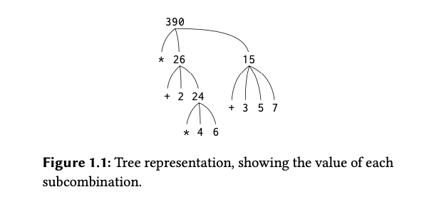
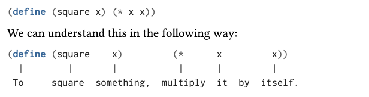

# 1.1.x Notes

- Processess manipulate other abstract things called data.
- The evolution of a process is directed by a pattern of rules called a program.
- Well designed computational systems are organized in a modular manner.
  - So **parts can be constructed, replaced, and debugged separately**.
- LISP is useful for studying the principles of programming languages.

## 1.1 The Elements of Programming

- A language is a framework within which we organize our ideas about processes.
- A language provides 3 mechanisms for combining simple ideas into complex ideas:
  - **Primitive Expressions:** the simplest entities the language is concerned with.
  - **Means of combination:** by which compound elements are built from simpler ones.
  - **Means of abstraction:** by which compound elements can be named and manipulated.
- Two kinds of **Elements**
  - **procedures** - description of rules for manipulating data
  - **data** - the "stuff" that we manipulate

## 1.1.1 Expressions

- The interpreter responds by displaying the result of its evaluating an expression
- Expressions representing numbers may be combined with an expression representing a primitive procedure (such as + or \*)

**Example:**

> _The following expressions can be referred to as "**combinations**". A combination is an expression that consists of applying a function to some arguments_
>
> `(<operator> <operand> <operand>)`

```lisp
(+ 33 33)
(- 33 33)
(* 33 33)
(/ 33 33)
(+ 3.3 3.3)
```

- The convention of placing the operator to the left is called _prefix notation_
  - Prefix notation is useful because it can take an arbitrary number of arguments: `(+ 8 6 7 5 3 0 9)`
  - It extends in a straight forward way to allow combinations to be nested.
    - Can have combinations whose elements are themselves combinations: `(+ (* 3 3) (- 33 3))`
    - In principle there is no limit to the depth of such nested combinations.
- **Pretty Printing:** Aligning the operands vertically.
  - Indentations clearly displaying structure
- Basic **Interpreter** cycle:
  - read-eval-print loop (REPL)

## 1.1.2 Naming and Environment

- A critical aspect of programming language is using a name to refer to a computational object.
- A **name** identifies a variable whose value is the object.
- Things are named with the `define` keyword in the _Scheme_ dialect of Lisp: `define size 2`
  - `define` is the language's simplest means of abstraction.
    - Allows for simple names to refer to the results of compound operations.
- These name-object associations are stored in memory.
  - This memory is called the **global environment**
- Computation may involve a number of different environments.

## 1.1.3 Evaluating Combinations

- Isolating issues and thinking procedurally.
  - The interpreter is following a procedure.

### Combinations in Lisp

> 1. **Basic Structure** : A combination in Lisp is written in the form of a list enclosed in parentheses. The first element of the list is typically a function or ÓÓÓHn operator, and the subsequent elements are the arguments to that function or operator.
> 2. **Evaluation Rule** : To evaluate a combination, Lisp follows a specific set of rules. First, it evaluates each of the elements of the combination. Then, it applies the function (the first element) to the results of the evaluated arguments (the other elements).
> 3. **Recursive Nature** : Combinations can be nested within each other. This means that an argument to a function can itself be a combination, which needs to be evaluated following the same rules.
> 4. **Example** : A simple combination in Lisp might look like this: `(+ 1 2)`. This expression represents a combination where the `+` function is applied to the arguments `1` and `2`. The result of this combination is the sum of `1` and `2`, which is `3`.
> 5. **Function Definitions and Calls** : In Lisp, functions are also defined using combinations. The arguments to the function and the body of the function are specified in a list structure, following the Lisp syntax.
> 6. **SICP Context** : In the context of SICP, combinations are fundamental to understanding how Lisp programs are structured and evaluated. The book uses combinations to illustrate key programming concepts like recursion, higher-order functions, and the evaluation model of Lisp.

### General Evaluation Rule

1. **Evaluate the Subexpressions**: First, evaluate each of the subexpressions of the combination.
   - In Lisp, a combination is typically a list where the first element is an operator or function, and the remaining elements are operands or arguments. Each of these subexpressions (operands/arguments) is evaluated recursively according to the same rule.
2. **Apply the Procedure**: After all the subexpressions have been evaluated, apply the procedure (the first element of the combination, assuming it's a function or operator) to the results of the evaluated subexpressions.

**Example Combination:**

> _This requires that evaluation rules be applied to four different combinations_

```lisp
(* (+ 2 (* 4 6 ))
   (+ 3 5 7))
```



- Recursion is a powerful technique for dealing with hierarchical, treelike objects.
  - `figure_1.1` represents a process known as **_tree accumulation_**
- Evaluating Primitive Cases:
  1. The value of numerals are the numbers that they name
      - There is no underlying evaluation to produce numerals.
  2. The values of **built-in operators** (+, -, \*, /, etc.) are the machine instruction sequences that carry out the corresponding operations.
      - **This is a special case of rule #3**
        - symbols such as `+` and `*` are included in the global evironment. Their values are associated with a sequence of machine instructions.
  3. The value of other names are the objects associated with those names in the enviornment.
      - The environment (memory) of the application store k-v pairs, where the name is a **variable** which is associated with some defined value.
- The environment provides context in which evaluation takes place.
- The evaluation rule for **operations** (example: `(+ 1 2)`) does not apply to **define** (example: `(define x 1`)
  - The purpose of define here is to associate the value of `x` with `1`, therefore this is **NOT** a combination
- Exceptions to the _General Evaluation Rule_ are called **special forms**
  - Each special form has its own evaluation rule
- The various expressions and their evaluation rules make up the syntax of the programming language.

> ⚠️ Special syntactic forms that are convenient alternativess for things are referred to as "syntactic sugar".
>
> "_Syntactic sugar causes cancer of the semicolon_" \- Alan Perlis

## 1.1.4 Compound Procedures

- Elements in Lisp that must appear in any powerful programming language:
  - Numbers and arithmetic operations are primitive data and procedures
  - Nesting of combinations provides a meaning of combination operations.
  - Definitions that associate names with values provide a limited means of abstraction

### Procedure Definitions

- An abstraction technique by which a compound operation can be given a name and then referred to as a **unit**. (_Like defining a function in JavaScript/Python/Go_)

> **General Form of a Procedure Name**:
>
> `(define (<name> <formal params>) (<body>))`

- The **`<name>`** is a symbol to be associated with the procedure definition in the environment.
- The **`<formal params>`** are the names used within the body of the procedure to refer to the corresponding arguments of the procedure. (_These are data that will be accessible within the scope of the body when the procedure/function is called.*)
- The **`<body>`** is an expression that will **yield the value** of the procedure application when the formal parameters are replaced by the actual arguments to which the procedure is applied.

#### Example: Squaring a number

> *“To square something, multiply it by itself.”*

```lisp
(define (square x) (* x x))
(square 3)
```

`output: 9`



```lisp
(square (square 3)) ;; equivalent to (3*3) * (3*3)
```

### Example: $x^2 + y^2$ (sum of squares)

> *Can use procedures as the building blocks for defining other procedures*

```lisp
(define (sum-of-squares x y)
  (+ (square x)
     (square y)))

(sum-of-squares 3 4)
```

`output: 25`

*Using `sum-of-squares` to construct further procedures*

```lisp
(define (f a)
  (sum-of-squares (+ a 1)
                   (* a 2)))
(f 5)
```

`output: 136`

> *`(f 5)` will evaluate as `(sum-of-squares  6 10) => (36 + 100) => 136`*

- Compound procedures are used in exactly the same way as primitive procedures.

## 1.1.5 The Substitution Model for Procedure Application
