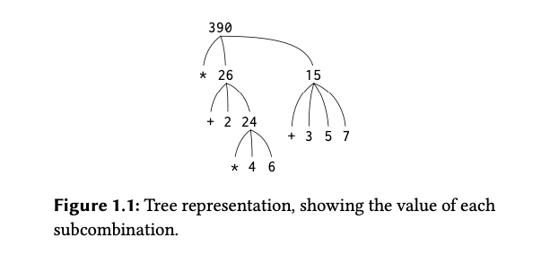
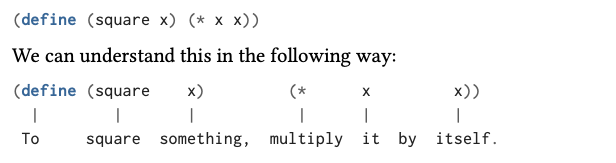
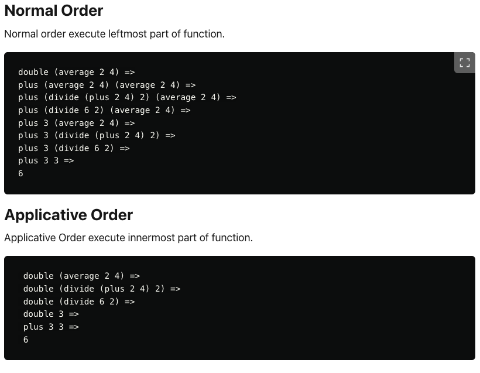
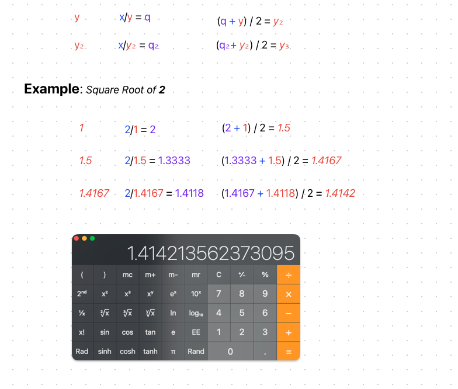
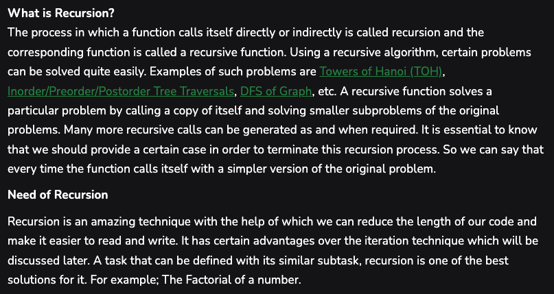

# 1.1.x Notes


## Introduction

- Processess manipulate other abstract things called data.
- The evolution of a process is directed by a pattern of rules called a program.
- Well designed computational systems are organized in a modular manner.
  - So **parts can be constructed, replaced, and debugged separately**.
- LISP is useful for studying the principles of programming languages.

## 1.1 The Elements of Programming

- A language is a framework within which we organize our ideas about processes.
- A language provides 3 mechanisms for combining simple ideas into complex ideas:
  - **Primitive Expressions:** the simplest entities the language is concerned with.
  - **Means of combination:** by which compound elements are built from simpler ones.
  - **Means of abstraction:** by which compound elements can be named and manipulated.
- Two kinds of **Elements**
  - **procedures** - description of rules for manipulating data
  - **data** - the "stuff" that we manipulate

## 1.1.1 Expressions

- The interpreter responds by displaying the result of its evaluating an expression
- Expressions representing numbers may be combined with an expression representing a primitive procedure (such as + or \*)

**Example:**

> _The following expressions can be referred to as "**combinations**". A combination is an expression that consists of applying a function to some arguments_
>
> `(<operator> <operand> <operand>)`

```lisp
(+ 33 33)
(- 33 33)
(* 33 33)
(/ 33 33)
(+ 3.3 3.3)
```

- The convention of placing the operator to the left is called _prefix notation_
  - Prefix notation is useful because it can take an arbitrary number of arguments: `(+ 8 6 7 5 3 0 9)`
  - It extends in a straight forward way to allow combinations to be nested.
    - Can have combinations whose elements are themselves combinations: `(+ (* 3 3) (- 33 3))`
    - In principle there is no limit to the depth of such nested combinations.
- **Pretty Printing:** Aligning the operands vertically.
  - Indentations clearly displaying structure
- Basic **Interpreter** cycle:
  - read-eval-print loop (REPL)

## 1.1.2 Naming and Environment

- A critical aspect of programming language is using a name to refer to a computational object.
- A **name** identifies a variable whose value is the object.
- Things are named with the `define` keyword in the _Scheme_ dialect of Lisp: `define size 2`
  - `define` is the language's simplest means of abstraction.
    - Allows for simple names to refer to the results of compound operations.
- These name-object associations are stored in memory.
  - This memory is called the **global environment**
- Computation may involve a number of different environments.

## 1.1.3 Evaluating Combinations

- Isolating issues and thinking procedurally.
  - The interpreter is following a procedure.

### Combinations in Lisp

> 1. **Basic Structure** : A combination in Lisp is written in the form of a list enclosed in parentheses. The first element of the list is typically a function or ÓÓÓHn operator, and the subsequent elements are the arguments to that function or operator.
> 2. **Evaluation Rule** : To evaluate a combination, Lisp follows a specific set of rules. First, it evaluates each of the elements of the combination. Then, it applies the function (the first element) to the results of the evaluated arguments (the other elements).
> 3. **Recursive Nature** : Combinations can be nested within each other. This means that an argument to a function can itself be a combination, which needs to be evaluated following the same rules.
> 4. **Example** : A simple combination in Lisp might look like this: `(+ 1 2)`. This expression represents a combination where the `+` function is applied to the arguments `1` and `2`. The result of this combination is the sum of `1` and `2`, which is `3`.
> 5. **Function Definitions and Calls** : In Lisp, functions are also defined using combinations. The arguments to the function and the body of the function are specified in a list structure, following the Lisp syntax.
> 6. **SICP Context** : In the context of SICP, combinations are fundamental to understanding how Lisp programs are structured and evaluated. The book uses combinations to illustrate key programming concepts like recursion, higher-order functions, and the evaluation model of Lisp.

### General Evaluation Rule

1. **Evaluate the Subexpressions**: First, evaluate each of the subexpressions of the combination.
   - In Lisp, a combination is typically a list where the first element is an operator or function, and the remaining elements are operands or arguments. Each of these subexpressions (operands/arguments) is evaluated recursively according to the same rule.
2. **Apply the Procedure**: After all the subexpressions have been evaluated, apply the procedure (the first element of the combination, assuming it's a function or operator) to the results of the evaluated subexpressions.

**Example Combination:**

> _This requires that evaluation rules be applied to four different combinations_

```lisp
(* (+ 2 (* 4 6 ))
   (+ 3 5 7))
```



- Recursion is a powerful technique for dealing with hierarchical, treelike objects.
  - `figure_1.1` represents a process known as **_tree accumulation_**
- Evaluating Primitive Cases:
  1. The value of numerals are the numbers that they name
     - There is no underlying evaluation to produce numerals.
  2. The values of **built-in operators** (+, -, \*, /, etc.) are the machine instruction sequences that carry out the corresponding operations.
     - **This is a special case of rule #3**
       - symbols such as `+` and `*` are included in the global evironment. Their values are associated with a sequence of machine instructions.
  3. The value of other names are the objects associated with those names in the enviornment.
     - The environment (memory) of the application store k-v pairs, where the name is a **variable** which is associated with some defined value.
- The environment provides context in which evaluation takes place.
- The evaluation rule for **operations** (example: `(+ 1 2)`) does not apply to **define** (example: `(define x 1`)
  - The purpose of define here is to associate the value of `x` with `1`, therefore this is **NOT** a combination
- Exceptions to the _General Evaluation Rule_ are called **special forms**
  - Each special form has its own evaluation rule
- The various expressions and their evaluation rules make up the syntax of the programming language.

> ⚠️ Special syntactic forms that are convenient alternativess for things are referred to as "syntactic sugar".
>
> "_Syntactic sugar causes cancer of the semicolon_" \- Alan Perlis

## 1.1.4 Compound Procedures

- Elements in Lisp that must appear in any powerful programming language:
  - Numbers and arithmetic operations are primitive data and procedures
  - Nesting of combinations provides a meaning of combination operations.
  - Definitions that associate names with values provide a limited means of abstraction

### Procedure Definitions

- An abstraction technique by which a compound operation can be given a name and then referred to as a **unit**. (_Like defining a function in JavaScript/Python/Go_)

> **General Form of a Procedure Name**:
>
> `(define (<name> <formal params>) (<body>))`

- The **`<name>`** is a symbol to be associated with the procedure definition in the environment.
- The **`<formal params>`** are the names used within the body of the procedure to refer to the corresponding arguments of the procedure. (\_These are data that will be accessible within the scope of the body when the procedure/function is called.\*)
- The **`<body>`** is an expression that will **yield the value** of the procedure application when the formal parameters are replaced by the actual arguments to which the procedure is applied.

#### Example: Squaring a number

> _“To square something, multiply it by itself.”_

```lisp
(define (square x) (* x x))
(square 3)
```

`output: 9`



```lisp
(square (square 3)) ;; equivalent to (3*3) * (3*3)
```

### Example: $x^2 + y^2$ (sum of squares)

> _Can use procedures as the building blocks for defining other procedures_

```lisp
(define (sum-of-squares x y)
  (+ (square x)
     (square y)))

(sum-of-squares 3 4)
```

`output: 25`

_Using `sum-of-squares` to construct further procedures_

```lisp
(define (f a)
  (sum-of-squares (+ a 1)
                   (* a 2)))
(f 5)
```

`output: 136`

> _`(f 5)` will evaluate as `(sum-of-squares  6 10) => (+ 36 100) => 136`_

- Compound procedures are used in exactly the same way as primitive procedures.

## 1.1.5 The Substitution Model for Procedure Application

- To apply a compound procedure to arguments, evaluate the body of the procedure with each formal parameter replaced by the corresponding argument.
  - ⚠️ **The substitution model is a method used to understand or illustrate how function application works in Lisp-like languages.**
  - It is not an actual implementation strategy but rather a pedagogical tool to help understand the evaluation process.

> **substitution model:**
>
> `(f 5)` :
>
> `(sum-of-squares  (+ a 1) (* a 2))` =>
>
> `(sum-of-squares  (+ 5 1) (* 5 2))` =>
>
> `(+  (square 6) (square 10))` =>
>
> `(+  (* 6 6) (* 10 10))` =>
>
> `(+ 36 100)` =>
>
> `136`

- A model that determines the "meaning" of procedure application
- **🧀 Note**:
  - The purpose of the substition is to help us think about procedure application, not provide a description of how the interpreter really works.
    - Real interpreters do not evaluate by manipulating the text of a procedure to substitute values for the formal parameters.
    - (_This book will introduce multiple, increasingly complex, models up to Chapter 5. This first model is simple and incomplete. In chapter 5 the complete implementation of an interpreter and compiler will be discussed._)
- An alternative to the _substitution model_ is the **normal-order evaluation**

### Normal order evaluation

> `(f 5)` :
>
> `(sum-of-squares  (+ 5 1) (* 5 2))` =>
>
> `(+  (square (+ 5 1)) (square (* 5 2)) )` =>
>
> `(+  (* (+ 5 1) (+ 5 1)) (* (* 5 2) (* 5 2)))` =>
>
> `(+  (* 6 6) (* 10 10))` =>
>
> `(+ 36 100)` =>
>
> `136`

- 👆🏾 Evaluations of `(+ 5 1)` and `(* 5 2)` are performed twice.

### Applicative Order Evaluation

> _In applicative order evaluation, the **arguments of a function are fully evaluated before the function itself is applied**. This is a **strict evaluation strategy**._

- **Example of `f 5`**:
  - The process begins by evaluating the arguments of `sum-of-squares` within the definition of `f`.
  - It evaluates `(+ 5 1)` which simplifies to `6`, and `(* 5 2)` which simplifies to `10`.
  - Then, `sum-of-squares` is applied to `6` and `10`. So, it involves computing `(square 6)` and `(square 10)`, and then adding these results.

### Normal Order Evaluation

> _In normal order evaluation, the **arguments of a function are not evaluated until their values are actually needed**. This is a **non-strict or lazy evaluation strategy**._

- **Example of `f 5`**:
  - The process starts by passing the expressions `(+ 5 1)` and `(* 5 2)` as they are to `sum-of-squares`.
  - In `sum-of-squares`, these expressions are substituted into its body, resulting in `(+ (square (+ 5 1)) (square (* 5 2)))`.
  - These inner expressions, `(+ 5 1)` and `(* 5 2)`, are then evaluated only when their values are needed for the computation of `square` and `+`.

#### 🔑 Key Differences

- **Evaluation Timing**:
  - Applicative order evaluates arguments as soon as possible (**eager evaluation**).
  - Normal order delays the evaluation of arguments until their values are actually needed (**lazy evaluation**).
- **Efficiency**:
  - Applicative order can be more efficient if all arguments are needed, as it **avoids repeated evaluations of the same argument**.
  - Normal order can be more efficient if not all arguments are needed, as it **avoids unnecessary evaluations**.
- **Redundant Computations**:
  - In applicative order, **each argument is evaluated once**.
  - In normal order, **an argument may be evaluated multiple times if it is used more than once in the function body**, unless specific mechanisms (like memoization) are employed to avoid this.

> 💡 The choice between applicative and normal order evaluation affects when and how often expressions are evaluated in the context of function calls.
>
> - **Applicative order is more straightforward and common**
> - **Normal order can save computational resources** in certain scenarios.
>   - Normal order may introduce complexity in managing deferred computations.

👾 **Lisp uses applicative-order evaluation.** 👾 (eager evaluation)

(Reference: <https://dev.to/showwaiyan/applicative-order-vs-normal-order-1dj>)



(Reference: <https://courses.cs.washington.edu/courses/cse505/99au/functional/applicative-normal.pdf>)
>
> - **Normal order** - rewrites/executes the leftmost occurence of a function application. (This is equivalent to call by name.)
> - **Applicative orde**r - rewrites/executes the innermost occurrence of a function application first. (This is equivalent to call by value.)

## 1.1.6 Conditional Expressions and Predicates

The construct for conditionals is called _**case analysis**_.

```lisp
(cond (⟨p-1⟩ ⟨e-1⟩)
      (⟨p-2⟩ ⟨e-2⟩)
      .
      .
      .
      (⟨p-n⟩ ⟨e-n⟩))
```

- The pairs that follow `cond` are called **clauses**
  - The first expression in the pair is called the **predicate** (`p`).
  - Expression whose value is interpreted as either `true` or `false`)

> 👾 ***Example**: Get the absolute value of x*

```lisp
(define (abs x)
  (cond ((> x 0) x)
        ((= x 0) 0)
        ((< x 0) (- x))))
```

- **Conditional expression evaluation:**
  - Predicate `p-1` is evaluated first,
    - if `false`:
      - `p-2` is evaluated
        - if `false`:
          - `p-3` is evaluated
            - ...
- This process will continue until a predicate that returns `true` is found.
  - The interpreter returns the value of the corresponding **consequent expression** (`e`) of the clause as the value of the conditional expression.
  - If none of the predicates return `true` the value of the `cond` is undefined.

*👾 Alternative with `else`*

```lisp
(define (absAltElse x)
  (cond ((< x 0) (- x))
        (else x)))
```

> _👆🏾 If `x` is less than `0` return `-x`; otherwise return `x`_

- **Predicate**
  - _Procedure_ that returns `true` or `false`
  - _Expressions_ that evaluate to `true` or `false`
- `else` is a special symbol that can be used in place of `p` in the final clause of a `cond`
  - Its consequent expression is returned when all other clauses have been bypassed.

*👾 Alternative with `if`*

```lisp
(define (absAltIf x)
  (if (< x 0)
      (- x)
      x))
```

> `if` is a restricted type of conditional that can only be used when there are precisely **two** cases in the _case analysis_.
>
>**General Form**:
> `(if <predicate> <consequent> <alternative>)`

- Primative predicates: `<`, `=`, `>`
- Logical composition operations, which enable compound predicates.
  - Most common 3:
    - **and**: `(and (e-1) ... (e-n))`
      - If any `e` evaluates to `false`, then the value of the expression is `false`. (Only true if all are true)
    - **or**: `(or (e-1) ... (e-n))`
      - If any `e` evaluates to `true`, then value of the expression is `true`. (Only false if all are false)
    - **not**: `(not (e))`
      - Is `true` when the expression `e` evaluates to `false`
- `and` & `or` are special forms, not procedures, because the subexpressions are not necessarily all evaluated.
  - `not` is an ordinary procedure.

> 👾 **Example**: _If one number is greater than or equal to another_

```lisp
(define (>= x y)
  (or (> x y)
      (= x y)))

(>= 4 2) ; true
(>= 2 2) ; true
(>= 1 2) ; false
```

*👾 Alternative with `not`*

```lisp
;; if x is less than y, expression will be true an `not` will return false.
(define (>=Alt x y)
  (not (< x y))) 

(>=Alt 4 2) ; true
(>=Alt 2 2) ; true
(>=Alt 1 2) ; false
```

## 1.1.7 Example: Square Roots by Newton's Method

> *The square root of $x$ is equal to any number $y$ such that $y$ is zero or more (non-negative), and when $y$ is squared, it equals $x$.*

$\sqrt{x} = \{ y \, | \, y \geq 0 \, \text{and} \, y^2 = x \}
$

```lisp
(define (sqrt x)
  (the y (and (>= y 0)
              (= (square y) x))))
```

- In **mathematics** we are usually concerned with _**declarative**_ descriptions (what is).
- In **computer science** we are usually concerned with _**imperative**_ descriptions (how to).
- Computing square roots
  - Using Newton's method of *successive approximations*
    - Whenever we have a guess $y$ for the value of the square root of $x$, a simple manipulation can be performed to get a better guess. (Averating $y$ with $x/y$)



> 👾 **`sqrt` program**

```lisp
(define (sqrt-iter guess x)
  (if (good-enough? guess x)
      guess
      (sqrt-iter (improve guess x)
                 x)))

(define (improve guess x)
  (average guess (/ x guess)))

(define (average x y)
  (/ (+ x y) 2))

(define (good-enough? guess x)
  (< (abs (- (square guess) x)) 0.001))

; Using a default guess of 1
(define (sqrt x)
  (sqrt-iter 1.0 x))

; ---------

(sqrt 9) ; Output: 3.00009155413138
(sqrt (+ 100 37)) ; Output: 11.704699917758145
(sqrt (+ (sqrt 2) (sqrt 3))) ; Output: 1.7739279023207892
(square (sqrt 100)) ; Output: 100.00000000279795
```

- Typically programming languages have explicit constructs for iteration (looping), like `for` loops and `while` loops. (_So far this has been avoided_).
- This procedure uses **iteration without looping** using  **recursive** procedure calls.
  - Each call to the procedure represents a step in the iteraton, and the iteration continues by making subsequent calls to the same procedure.
- This is a more **functional** style rather than using **imperative loops**.

---

### Comparison: Imperative vs Functional

<table>
    <thead>
        <tr>
            <th>Aspect</th>
            <th>Imperative Programming</th>
            <th>Functional Programming</th>
        </tr>
    </thead>
    <tbody>
        <tr>
            <td><strong>Definition</strong></td>
            <td>Focuses on describing how a program operates, using statements that change a program's state.</td>
            <td>Emphasizes what to compute, treating computation as the evaluation of mathematical functions and avoids changing-state and mutable data.</td>
        </tr>
        <tr>
            <td><strong>Key Features</strong></td>
            <td>- Use of loops for iteration<br>- Assignment statements<br>- Control structures like <code>if</code>, <code>else</code></td>
            <td>- Recursion for iteration<br>- Functions as first-class citizens<br>- Emphasis on statelessness and immutability</td>
        </tr>
        <tr>
            <td><strong>Iteration</strong></td>
            <td>Achieved through loops (<code>for</code>, <code>while</code>).</td>
            <td>Achieved through recursion (self-referencing functions).</td>
        </tr>
        <tr>
            <td><strong>State and Data</strong></td>
            <td>Often relies on mutable state and side effects.</td>
            <td>Focuses on immutable data and statelessness.</td>
        </tr>
    </tbody>
</table>

---




### Exercise 1.6

```lisp
(define (new-if predicate then-clause else-clause)
  (cond (predicate then-clause)
        (else else-clause)))
```

The default `if` statement is a **special form** which means that **even when an interpreter follows applicative substitution, it only evaluates one of its parameters- not both**.

However, the newly created `new-if` doesn't have this property and hence, *it never stops calling itself due to the third parameter passed to it in sqrt-iter*.

> The act of re-defining a special form using generic arguments effectively "De-Special Forms" it. **It then becomes subject to applicative-order evaluation**, such that any expressions within the consequent or alternate portions are evaluated regardless of the predicate.

In Ex 1.6, the iteration procedure is called without return and eventually overflows the stack causing an out of memory error.


